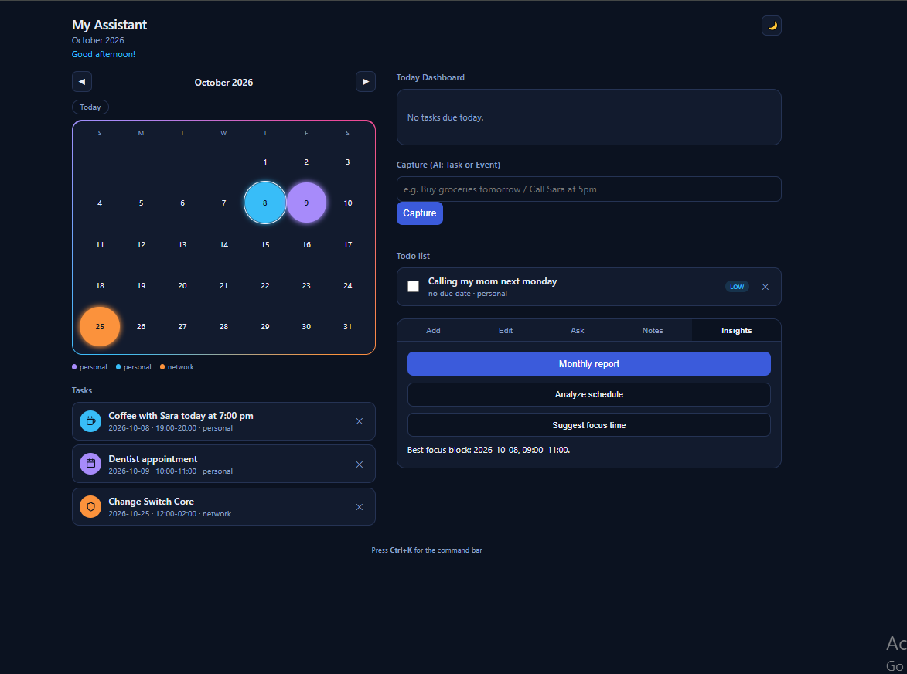

# My Assistant — AI Calendar & Todo

A local-first personal assistant that combines a calendar, a task manager, and a local AI model
(via [Ollama](https://ollama.com)) — no API key, no cloud, no subscription. Built as a learning
project while picking up Python, JSON, and the basics of AI agents / tool calling, with a few
features aimed at network engineers (FortiGate, SSL/WAF, Firepower task icons).

## Features

**Calendar**
- Month view with color-coded events, month navigation, "Today" shortcut
- Natural-language quick add ("Coffee with Sara Friday 5–6pm")
- Natural-language edit ("Move the bank meeting to Oct 25")
- Conflict detection for overlapping meeting times
- Free-time finder and a focus-time suggestion
- Monthly report (event count, total hours, busiest days, AI-written summary)
- Notes per month

**Todo / Tasks**
- Separate from the calendar — only time-specific items become calendar events
- AI capture: one input field that decides whether a sentence is a *task* or an *event*
- Priority levels, due dates, categories
- Today dashboard: progress %, top priority task, free time today

**Assistant**
- `Ctrl+K` command bar for adding, editing, searching, and navigating by natural language
- Background reminders (desktop notifications) a configurable number of days before an event
- Everything runs on a local LLM through Ollama — your data never leaves your machine

**Design**
- Dark / light theme toggle
- Responsive: compact single-column layout on narrow screens, two-column layout on desktop
- Monthly background photo (bring your own images — see Setup)

## Tech stack

- Python, Flask
- [Ollama](https://ollama.com) running a local model (`llama3.2`)
- Vanilla HTML/CSS/JS front end (no framework)
- JSON files for storage (`data.json`, `tasks.json`, `notes.json`)

## Setup

1. Install [Python 3](https://www.python.org/) and [Ollama](https://ollama.com)
2. Pull the model used by this project:
   ```
   ollama pull llama3.2
   ```
3. Install the Python dependencies:
   ```
   pip install -r requirements.txt
   ```
4. (Optional) Add your own monthly background photos to `static/backgrounds/`,
   named `1.jpg` … `12.jpg` (one per month). The app runs fine without them.
5. Run it:
   ```
   python app.py
   ```
   The app opens automatically at `http://127.0.0.1:5000`.

## Known limitations

- Reminders only fire while `app.py` is running.
- The AI features depend on Ollama running locally (`ollama serve` / the Ollama app).
- This is a learning project, not a production tool — there's no authentication and it's meant
  to run on one machine for one person.
  ## Screenshots
  ### TODO-LIST-suggest
  
  
  

## Roadmap

- Package as a standalone `.exe` with PyInstaller
- Habits, goals, and recurring 21-day challenges
- Behavioral insights (daily/weekly review)
